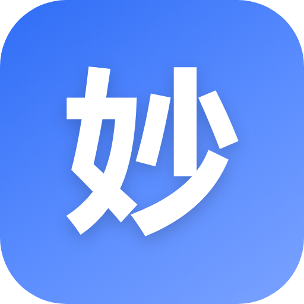

# 巴别回声 · Babel Echo



**把会议里的声音，整理成可以回看的文字。** 巴别回声是一款在 Windows 和 Apple Silicon Mac 本机运行的 AI 会议记录工具，支持同时录入麦克风和电脑播放的声音，边录边转写，并生成摘要、纪要与翻译。

**Turn meeting audio into notes you can revisit.** Babel Echo is a local AI meeting workspace for Windows and Apple Silicon Macs. It can capture your microphone and computer audio together, transcribe as you record, and generate summaries, minutes, and translations.

**源码版本 / Source version:** `0.1.0-beta.4` · 测试中 / in testing · [已发布安装包 beta.3 / Published beta.3](https://github.com/ndof0ssome-114/babel-echo/releases/tag/v0.1.0-beta.3)

[简体中文](#简体中文) · [English](#english) · [开发者与 AI 接手文档 / Developer & AI guide](README_AI.md)

## 简体中文

### 能做什么

- **录音与转写：** 在 Windows 或 M 芯片 Mac 桌面版中选择并测试麦克风，可同时录入电脑正在播放的声音；转写内容随录音更新。
- **会议整理：** 查看滚动摘要、生成结构化纪要、逐句翻译，并根据会议内容提问。
- **导入、回看与导出：** 导入音视频文件，保存会议历史和录音，从时间戳跳转回放；导出 Markdown、VTT、双语字幕、TXT 或 JSON。
- **按需选模型：** 在设置中更换 API Key、模型 ID 和接口地址。语音识别支持 MiMo、Groq、Deepgram 及兼容 OpenAI Audio 的本地服务；文本任务支持 DeepSeek、MiMo 及兼容 OpenAI Chat Completions 的服务。
- **调整识别节奏：** 可设置预览发送间隔、停顿定稿时间、最长单句及跨段衔接音频。界面提供简体中文、日语和英语。

> **日语识别：** MiMo ASR 只支持中文和英文。录日语时，请选择支持日语的 Groq、Deepgram 或本地语音模型。其他语言的效果也取决于所选服务。

### 开始使用

**安装版：** 从 [预发布页面](https://github.com/ndof0ssome-114/babel-echo/releases/tag/v0.1.0-beta.3) 下载 `BabelEcho-0.1.0-beta.3-setup.exe`，在向导中选择安装范围和目录。安装包目前未签名。首次录音前：

1. 打开「设置」，配置语音识别和文本模型；使用云端服务时填写相应的 API Key。若使用本地模型，请先自行启动模型服务并加载模型。
2. 选择识别语言与麦克风，点击「测试麦克风」确认有输入。需要录入会议播放声时，勾选「同时录电脑声音」。
3. 开始录音；结束后在历史记录中回看、导出或生成纪要。

**从源码运行：** 需要 Node.js 20 或更新版本。浏览器模式无需安装 npm 依赖：

```powershell
node server.mjs 8777
```

然后打开 `http://127.0.0.1:8777`。若要运行 Electron 桌面版：

```powershell
cd desktop
npm install
npm start
```

**M 芯片 Mac 测试版：** 需要 macOS 13 或更高版本。在 Mac 上执行 `npm ci --prefix desktop`，然后运行 `npm --prefix desktop run dist:mac`，生成 arm64 DMG 和 ZIP。首次勾选「同时录电脑声音」时，macOS 会请求麦克风、屏幕与系统音频录制权限；应用只保留混合后的音频，不保存屏幕画面。macOS 12 及更早版本无法由 Electron 直接采集系统音频。

仓库中的 **Build macOS Apple Silicon** 手动工作流可生成内部测试包；启用 signed 输入前，需要在 GitHub Actions 配置 `MAC_CSC_LINK`、`MAC_CSC_KEY_PASSWORD`、`APPLE_ID`、`APPLE_APP_SPECIFIC_PASSWORD`、`APPLE_TEAM_ID`。未签名包只适合内部测试，公开下载应使用 Developer ID 签名并完成 Apple 公证。

### 选择模型与控制用量（beta.4）

在「设置 → 任务模型」中，为摘要、翻译、纪要和问答分别选择服务与模型。DeepSeek 可直接选 Flash 或 Pro；其他服务可点击「读取模型列表」。列表不可用时选择「手动输入模型 ID」，填写服务提供的准确 ID，然后保存。更改接口地址或密钥后先保存，再读取列表。语音引擎的「连接设置」也支持模型列表与手动输入。

摘要与翻译默认关闭 DeepSeek 官方接口的思考模式；纪要与问答遵循服务默认，也可分别调整。本地及其他兼容接口不会发送 DeepSeek 专用的思考参数。

「设置 → 摘要与用量」可设置自动摘要间隔、最少新增字数和目标摘要长度。新配置默认每 180 秒检查、至少新增 200 字才总结；升级会保留已有间隔，原先的 60 秒可自行改为 180 秒。间隔设为 0 可关闭自动摘要。每次只发送上一版摘要和新增转写；无新增转写不调用，手动总结不受字数门限限制。

「统计」按任务显示请求数与输入/输出 token，包括重试和失败响应中可取得的用量；服务未报告的用量无法估算，旧会议也无法补齐历史漏记。最终费用以服务商账单为准。实时翻译会增加请求数；无需翻译时可在录音前选择「不翻译」。

### 数据与测试版说明

桌面版的会议、录音、设置和保存的 API Key 位于当前用户的 `%APPDATA%\miaoji-desktop`。这是为兼容旧版保留的目录名。卸载时会先确认，并询问是否保留数据；默认保留，选择删除会一并删除保存的 API Key。API Key 当前以本机明文文件保存。

音频片段会发送给你选用的语音识别服务；摘要、纪要、翻译或问答所需的文字会发送给你选用的文本模型。本地模型需由你自行运行。录音前请告知相关参与者，并确认所用服务适合处理会议内容。详见 [数据与录音说明](PRIVACY.md) 和 [安全说明](SECURITY.md)。

目前是本机单用户测试版，没有账号同步或云端会议存储；说话人区分的准确度依赖所选引擎。本仓库尚未提供开源许可证，也未发布公开正式版。图标基于使用者提供的角色参考图制作，本仓库不授予第三方复用该角色或图标的许可。

开发、测试、接口与排障资料见 [README_AI.md](README_AI.md)。

## English

### What it does

- **Record and transcribe:** On Windows or an Apple Silicon Mac, choose and test a microphone, optionally capture computer playback, and see transcripts update during recording.
- **Understand the meeting:** Read a rolling summary, generate structured minutes, translate completed utterances, and ask questions about the conversation.
- **Import, review, and export:** Import audio or video files, keep local meeting history and audio, jump to timestamps during playback, and export Markdown, VTT, bilingual subtitles, TXT, or JSON.
- **Choose your models:** Set API keys, model IDs, and endpoints. Speech recognition supports MiMo, Groq, Deepgram, and local OpenAI Audio compatible services; text tasks support DeepSeek, MiMo, and OpenAI Chat Completions compatible services.
- **Tune recognition:** Adjust preview frequency, pause detection, maximum utterance length, and overlap between segments. The interface is available in Simplified Chinese, Japanese, and English.

> **Japanese speech:** MiMo ASR supports Chinese and English only. Select Groq, Deepgram, or a local speech model that supports Japanese. Results for other languages also depend on the provider you choose.

### Get started

**Installer:** Download `BabelEcho-0.1.0-beta.3-setup.exe` from the [prerelease page](https://github.com/ndof0ssome-114/babel-echo/releases/tag/v0.1.0-beta.3), then choose the installation scope and directory. The installer is currently unsigned. Before recording:

1. Open Settings and configure speech and text models. Add API keys for cloud providers. For local models, start the service and load the model yourself.
2. Choose the recognition language and microphone, then use **Test microphone** to check the input. Enable **Capture computer audio** if you also need meeting playback.
3. Start recording. Afterwards, open History to review, export, or generate minutes.

**Run from source:** Node.js 20 or newer is required. Browser mode has no npm dependencies:

```powershell
node server.mjs 8777
```

Open `http://127.0.0.1:8777`. To run the Electron desktop app:

```powershell
cd desktop
npm install
npm start
```

**Apple Silicon Mac test build:** macOS 13 or newer is required. On a Mac, run `npm ci --prefix desktop`, followed by `npm --prefix desktop run dist:mac`, to create arm64 DMG and ZIP packages. The first computer-audio recording asks for microphone, screen, and system-audio permissions. Babel Echo discards the video track and saves audio only. Electron cannot capture system audio directly on macOS 12 or earlier.

The manual **Build macOS Apple Silicon** workflow creates internal test artifacts. A public build should be signed with a Developer ID certificate and notarized by Apple; the workflow supports this after the repository secrets documented in the Chinese section are configured.

### Models and usage controls (beta.4)

Under **Settings → Task models**, choose a provider and model separately for summaries, translation, minutes, and Q&A. DeepSeek offers Flash and Pro directly. Use **Load model list** for other providers, or **Enter model ID manually** when discovery is unavailable. Save endpoint or key changes before loading the list. Speech providers offer the same selection under Connection settings.

Summary and translation disable thinking by default on the official DeepSeek API. Minutes and Q&A keep the provider default; each task can override it. These vendor-specific options are not sent to local or other compatible endpoints.

**Summary and usage** controls the automatic interval, minimum new characters, and target summary length. New configurations check every 180 seconds and require 200 new characters. Upgrades preserve existing intervals: change an existing 60-second interval to 180 seconds if desired. Set the interval to 0 to disable automatic summaries. Only the previous summary and new transcript are sent; no new text means no call. Manual summaries bypass the character threshold.

Statistics include per-task request counts and input/output tokens, including retries and reported usage from failed responses. Missing provider usage and legacy undercounting cannot be reconstructed. Provider bills remain authoritative. Live translation adds requests; select **No translation** before recording when it is unnecessary.

### Data and beta status

The desktop app keeps meetings, recordings, settings, and saved API keys in `%APPDATA%\miaoji-desktop`. The older directory name is retained for data compatibility. The uninstaller asks whether to keep this data and defaults to keeping it; choosing deletion also removes saved API keys. Keys are currently stored in a local plaintext file.

Audio segments go to the speech service you select. Text needed for summaries, minutes, translation, or Q&A goes to your selected text model. You must run local model services yourself. Inform meeting participants before recording and make sure your chosen providers are appropriate for the content. See [Privacy and recording](PRIVACY.md) and [Security](SECURITY.md).

This is a single-user local beta with no account sync or cloud meeting storage. Speaker separation depends on the selected engine. There is no open-source license or public stable release yet. The icon was made from a character reference supplied by the project user; this repository does not grant others permission to reuse that character or icon.

For architecture, APIs, tests, and troubleshooting, see [README_AI.md](README_AI.md).
